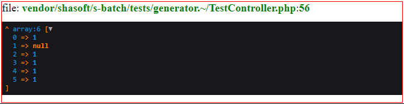
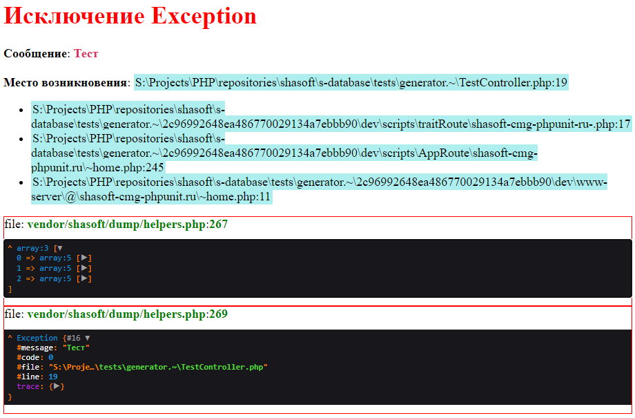

# Пакет с функциями помогающими в отладке PHP приложений

Содержит функции **s_dd** (аналог [dd](https://laravel.com/docs/master/helpers#method-dd) ) и **s_dump** (аналог [dump](https://laravel.com/docs/master/helpers#method-dump)) с выводом места вызова данных функций. Чтобы удобно было удалять вызовы когда они не нужны.



А также функцию **s_dump_error** для вывода информации о возникшем исключении.
```php
    function s_dump_error(string $title, \Exception|\Error $e) {...}

    //--------------------------------------------------------------------------------
    try {
        throw new \Exception('Тест');
    } catch (\Exception $e) {
        s_dump_error('Исключение ' . get_class($e), $e);
        exit(1);
    } catch (\Error $e) {
        s_dump_error('Ошибка ' . get_class($e), $e);
        exit(2);
    }
```

